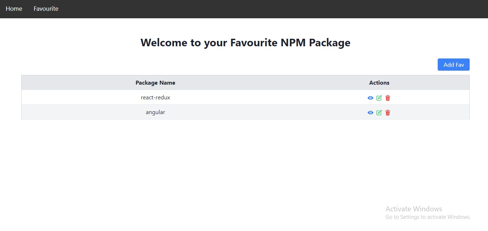

# My Awesome NPM Package Manager App Documentation

## Table of Contents

- [How to Start the App](#how-to-start-the-app)
- [Screenshots](#screenshots)
  - [Home Page](#home-page)
  - [Favourite Page](#favourite-page)
- [App Functionality](#app-functionality)
  - [Edit](#edit)
  - [Delete](#delete)
  - [View](#view)
  - [Responsiveness](#responsiveness)
  - [Local Storage](#local-storage)
- [Tech Stack](#tech-stack)

## How to Start the App

To run the app locally, follow these steps:

1. Clone the repository:

   ```bash
   git clone https://github.com/GaneshYadav3142/betalectic_Package_Manager_App.git

2. Move to myapp: 
   
   ```bash
   cd myapp

3. Install Necessary Dependencies: 

    ```bash
   npm install

4. Start the app the app will run on port 3000:

    ```bash
    npm start
    
   
## Screenshots

### Homepage


### Favourite Page




## App Funtionality

1. These app is Fully Responsive to all Screens available:

2. You can Add your Favourite NPM package by Searching for it:


3. You can Edit your "npm" & "why" Description,by clicking on Edit icon Option a Edit Dialog box will appear:


4. Similarly you can Delete your favourite NPM package,by clicking on Delete icon Option a delete confirmation Dialog box will appear:


5. Similarly yu can view details of your favourite NPM package,by clicking on View icon Option a delete confirmation Dialog box will appear:


6. Data such as favourite items is stored in the browser's local storage.


## Tech Stack

The app is built using the following technologies:

1. React with TypeScript:
2. Chakra UI for component styling:
3. Tailwind CSS for additional styling and Responsiveness for all screen:
